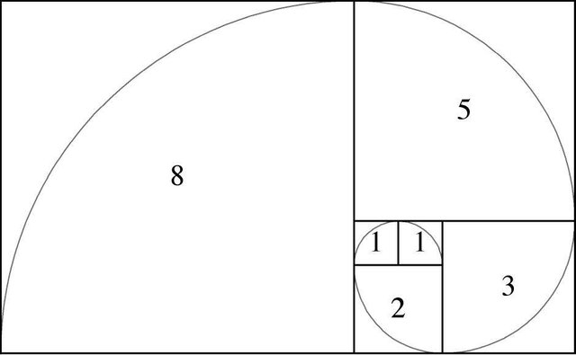
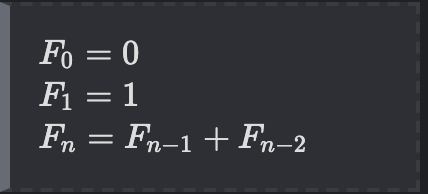

# 피보나치 수열

 
 

# 스택으로 큐 구현
- 새로운 데이터를 쌓는 스택(stackNewest를), 오래된 데이터를 꺼내기 위한 스택(stackOldest) 이렇게 2개의 스택을 이용하면 구현 가능
- stackNewest를 stackOldest 옮기면서 순서를 뒤집는 역할의 shiftStacks()메서드를 구현해서 큐에서 꺼낼때마다 shiftStacks()
  - 단 오래된 데이터가 비었을 때만 shiftStacks() 메서드를 실행해야지만 데이터가 꼬이지 않음

## 다음 과제
- Stack 정렬 구현, 각 부서 임금 합계 구하기

