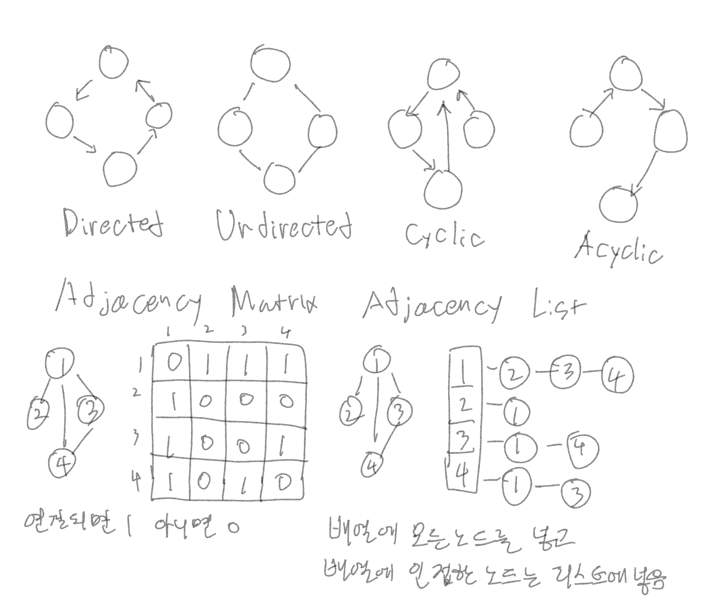

# 그래프(Graph)

## Tree VS Graph
- Tree는 root가 있고 입구가 1개고 cycle 없이 edge 방향이 아래로만 진행되는 Graph이다.
  - Directed Graph
- Graph는 아무제약 없이 노드가 구성된 형태이다

## Directed VS Undirected
- Graph는 방향이 있을 수도 있고 없을 수도 있다.
- self edge: 자기자신을 가리킴

## Cyclic VS Acyclic
- 출발한 노드로 다시 돌아와서 원을 그리는 것을 Cyclic Graph

## Graph를 표현하는 방법
- Adjacency Matrix: 2차원에 배열로 표현
- Adjacency List: Linked List로 표현

## Adjacency Matrix
- 인접(선으로 연결)하면 1, 아니면 0을 채운 2차 배열로 표현

## Adjacency List
- 배열에 모든 노드를 집어넣고 각 배열에 인접한 노드들을 리스트에 넣음
- 배열의 갯수가 m일때 모든 노드의 갯수는 2m

[뒤로](./../../README.md)